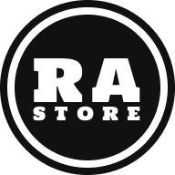

<p align="center"><a href="https://github.com/tengkuzainul/simast-app" target="_blank"></a></p>

## How to install

```bash
# clone project
git clone https://github.com/tengkuzainul/simast-app.git

# change directory to folder cloning
cd simast-app

# Copy file env.example
cp .env.example .env
```

```bash
# install composer dependencies
composer install

# migrate database
php artisan migrate --seed

# actived the link storage
php artisan storage:link
```

```bash
# actived the server dev
php artisan serve --host=localhost --port=8000
```

## Login Acount

```bash
email : owner2025@gmail.com
password : password
```

## License

The Laravel framework is open-sourced software licensed under the [MIT license](https://opensource.org/licenses/MIT).
